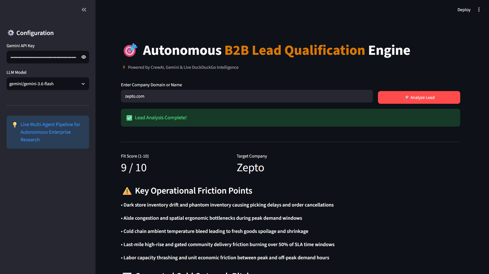

# 🎯 Autonomous B2B Lead Intelligence & Qualification Agent

An enterprise-grade autonomous multi-agent pipeline built with **CrewAI**, **Python**, and **Gemini 3.5**. This system autonomously conducts live web intelligence on target companies, identifies operational friction and manual bottlenecks, evaluates enterprise automation fit, and outputs structured, personalized cold outreach emails.

---

## 🚀 Key Features

* **Multi-Agent Orchestration:**
  * **Lead Intelligence Analyst:** Autonomous agent utilizing DuckDuckGo Search to extract technical infrastructure, operational models, and enterprise pain points.
  * **Value Proposition Strategist:** Evaluates lead automation fit (1-10) and crafts hyper-personalized cold outreach emails based on discovered bottlenecks.
* **Structured Output Validation:** Enforces strict Pydantic schemas (`LeadEvaluation`) to guarantee deterministic JSON output.
* **Resilient API Handling:** Implements automatic quota-cooldown mechanisms and multi-model support.
* **Batch Lead Ingestion:** Automated evaluation loops processing prospects directly from `leads.csv`.

---

## 📊 Sample Intelligence Output (Shopify Evaluation)

```json
{
  "company_name": "Shopify Inc.",
  "fit_score": 9,
  "key_pain_points": [
    "Manual data mapping and transformation during enterprise migrations to Shopify Plus.",
    "App Store review backlogs and manual compliance verification.",
    "Risk underwriting and document verification friction for Shopify Payments & Capital."
  ],
  "cold_pitch_email": "Subject: Accelerating Shopify Plus Onboarding & Risk Triage with AI\n\nHi Team,\n\nWhile Shopify powers global commerce, manual bottlenecks in enterprise migrations and underwriting are likely slowing down your time-to-revenue. Solution Engineers spending hours manually mapping databases creates massive friction.\n\nWe build custom Python automation pipelines to solve this exact friction by deploying OCR-driven document verification and schema auto-mapping. Are you open to a brief chat next week?"
}

```

## 🛠️ Tech Stack
   ```bash
​   Framework: CrewAI
​   Language: Python 3.11+
​   LLM Engine: Gemini 3.5 Flash
​   Search Integration: DuckDuckGo Search (ddgs)
​   Schema Validation: Pydantic v2
   ```
## ⚙️ Quickstart
   
1. **Clone the repository:**
   ```
   git clone https://github.com/satyanarayana51115/b2b-lead-qualification-agent.git
   cd b2b-lead-qualification-agent
   ```
2. **Virtual Environment:**
   
*  **On Windows:**
   ```
   python -m venv venv
   venv\Scripts\activate
   ```
*  **On macOS/Linux:**
   ```
   python3 -m venv venv
   source venv/bin/activate
   ```
3. **Install Dependencies:**
   ```
   pip install crewai duckduckgo-search pydantic python-dotenv
   ```
4. **Configure API Keys:**
   ```
   GEMINI_API_KEY=your_gemini_api_key_here
   ```
5. **Run the Engine:**
   ```
   python app.py
   ```
## 🗺️ Roadmap
```
​  - [x] Multi-Agent Core Extraction Pipeline (v1.0)
​  - [ ] Interactive Streamlit Web Interface (v1.1)
​  - [ ] Social Selling  and Executive Hiring Intent Scraper (v2.0)
```
## 🖥️ Interactive Web UI Demo



### 🔄 Agentic Architecture Flow

```text
[Target Domain: zepto.com]
          │
          ▼
   [Streamlit Web UI]
          │
          ▼
 [Agent 1: Lead Intelligence Analyst]
    └── DuckDuckGo Live Web Search (Operational friction, dark stores, logistics)
          │
          ▼
 [Agent 2: Value Proposition Strategist]
    └── Gemini 3.6-flash + Pydantic Schema Validation
          │
          ▼
 [Structured Output]
    ├── Automation Fit Score (e.g. 9/10)
    ├── Key Operational Bottlenecks
    └── Hyper-Personalized Cold Outreach Pitch
